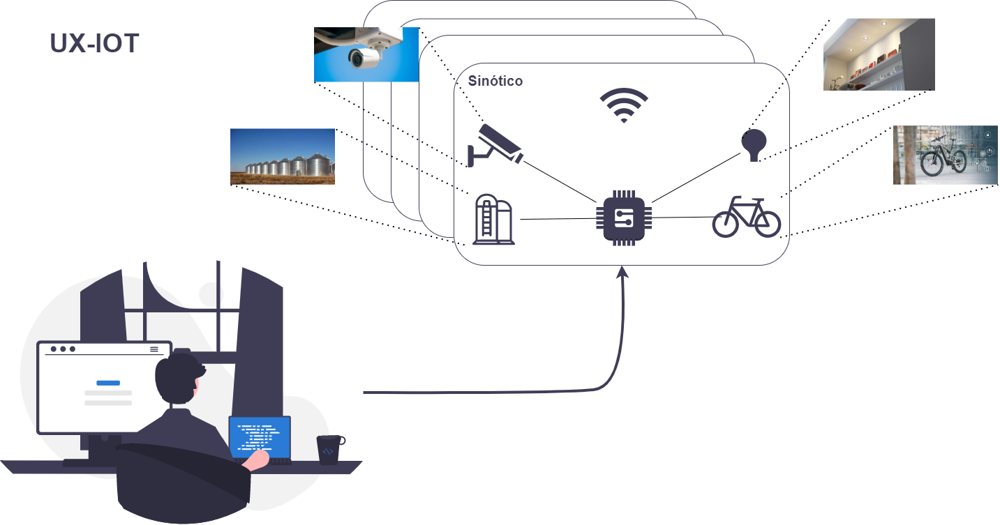

<h1 align="center"> IoT Manager </h1>

<p align="center">
  <a href="#technologies">Technologies</a>&nbsp;&nbsp;&nbsp; |&nbsp;&nbsp;&nbsp;
  <a href="#project">Project</a>&nbsp;&nbsp;&nbsp; |&nbsp;&nbsp;&nbsp;
  <a href="#running-the-application">Running the Application</a>&nbsp;&nbsp;&nbsp; |&nbsp;&nbsp;&nbsp;
  <a href="#paper">Paper</a>&nbsp;&nbsp;&nbsp; |&nbsp;&nbsp;&nbsp;
  <a href="#layout">Layout</a>&nbsp;&nbsp;&nbsp; |&nbsp;&nbsp;&nbsp;
  <a href="#memo-license">License</a>
</p>

<p align="center">
  
</p>

<br>

<p align="center">
  
</p>

<br>
<br>

# Technologies

This project was developed with the following technologies:

- Java
- JavaScript
- Node.Js
- PostgreSQL
- Rest API
- TypeScript
- CSS
- HTML
- Vaadin
- Lit
- Git
- GitHub

<br>

# Project

The project's main goal was to design a Web interface for IoT network devices through Web Components, aiming at its use by users of technological framework management systems involving cyber-physical equipments. The graphical representation was also intended to be inserted as elements that allow users to interact with the devices and manipulate them by changing their attributes. 

<br>

# Running the Application

## IoT Management App

The project is a standard Maven project. To run it from the command line,
type `mvnw` (Windows), or `./mvnw` (Mac & Linux), then open
http://localhost:8080 in your browser.

You can also import the project to your IDE of choice as you would with any Maven project. <br>
Read more on [how to import Vaadin projects to different IDEs](https://vaadin.com/docs/latest/flow/guide/step-by-step/importing) (Eclipse, IntelliJ IDEA, NetBeans, and VS Code).

### Deploying to Production

To create a production build, call `mvnw clean package -Pproduction` (Windows),
or `./mvnw clean package -Pproduction` (Mac & Linux).
This will build a JAR file with all the dependencies and front-end resources,
ready to be deployed. The file can be found in the `target` folder after the build completes.

Once the JAR file is built, you can run it using `java -jar target/iotmanager-1.0-SNAPSHOT.jar`.

### SQL

In the .github folder you can find a file named "UX-IOT Schema.sql" that includes all the necessary schemas to create your DB tables and all that you need to do is just to import it to a admnistration database program. For that we suggest [DBeaver](https://dbeaver.io/) but you can use one of your preference. 
       
## IoT Simulator

To get all the information of your web component while manipulating his specifications you need to have the [NodeJS](https://nodejs.org/en/) installed. <br>
To run the program you need to insert the following command: 

```shell
# Node modules
    npm install
```

```shell
# Run node
    npm start
```

<br>

# Paper

If you wish to read how this project was developed and the process of construction you can go to our docs folder and read
the pdf that contains the [UX-IOT paper](.github/P008_LEIRT_Report.pdf).

<br>

# Layout

The Project uses the App Layout setup from Vaadin framework and can be viewed through [THIS LINK](https://vaadin.com/components/vaadin-app-layout). <br>
The layout can be observed individually and changed by accessing the following files:

- `MainLayout.java` in `src/main/java` contains the navigation setup (i.e., the
  side/top bar and the main menu).
- `views` package in `src/main/java` contains the server-side Java views of your application.
- `views` folder in `frontend/` contains the client-side JavaScript views of your application.
- `themes` folder in `frontend/` contains the custom CSS styles.

### Useful links

- Read the Vaadin documentation [HERE](https://vaadin.com/docs).
- Read the Lit documentation [HERE](https://lit.dev/docs/).

<br>

# :memo: License

This project is under the MIT License.

---

Developed by [Tiago Cebola](https://github.com/TiagoCebola) and [Gustavo Campos](https://github.com/gustavodev1998), belonging to the LEIRT61D class at ISEL. :wave: